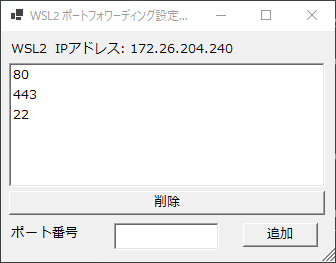

# WSL2_PORTPROXY

GUIでWSL2のポートフォワーディングの設定をするツール

## インストール方法 & 実行

1. [Releases](https://github.com/Himeyama/wsl2_portproxy/releases) で `wsl2_portproxy.zip` をダウンロードし解凍する。
1. `install.ps1`を右クリックし、「PowerShell で実行」をクリックする。
1. 管理者権限で PowerShell を開き、`wsl2_portproxy`を実行する。

### 補足
PowerShell を管理者権限で開くには、画面左下の Windows マークを右クリックし、
Windows PowerShell (管理者) をクリックして開くことができる。
